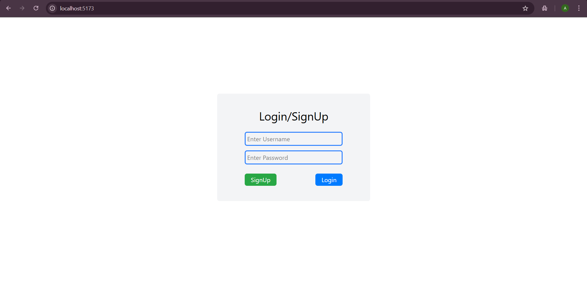
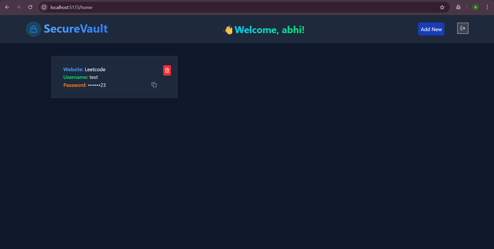

# 🔐 Password DigiLocker – Secure Password Manager  

A secure and interactive web application to store and manage your passwords safely. This project provides a clean UI, easy password management, and persistent storage using localStorage.  

---

## 📸 Preview  
### Login Page


### Dashboard



🌐 **Live Demo:** [View the live app here](https://roaring-longma-8f8c87.netlify.app/)  

---

## 🚀 Features  
- ✨ User SignUp and Login with validation  
- 🗂 Add and delete credentials for websites  
- 🔒 Passwords are partially hidden for security  
- 📋 Copy passwords to clipboard with a click  
- 💾 Persistent data using localStorage  
- 📱 Fully responsive and mobile-friendly design  

---

## 🧰 Tech Stack  
- **React.js**  
- **Tailwind CSS**  
- **JavaScript (ES6)**  
- **localStorage** for data persistence  
- **Lucide React** icons  

---

## ⚡ Getting Started  

### 1️⃣ Clone the repository  
```bash
 git clone https://github.com/abhiho11a/React-projects-for-beginners.git
 cd React-projects-for-beginners/password-digilocker
 npm install
 npm start
